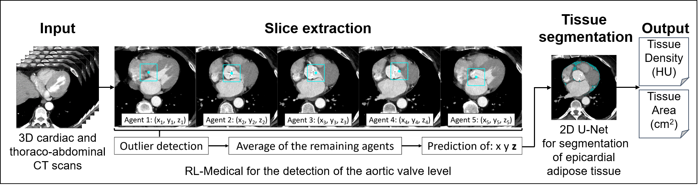

# EAT Assessment 
This project encompasses two main components: 
A system for detecting specific anatomical landmarks in medical images using a Reinforcement Learning (RL) approach, 
and another system for assessing epicardial adipose tissue (EAT) through segmentation.



## Installation

Before you start, ensure you have Python >= 3.9 and [PyTorch](https://pytorch.org/) >= 1.12.1 installed. 
The installation requirements cover both parts of the project.
To install the necessary libraries, please follow these steps:

1. Clone this repository to your local machine.
2. Install the required dependencies via running pip:
```
pip install -r requirements.txt
```
    
## Usage

The trained models are currently not publicly available due to German data protection law. 
Sharing the models requires a research agreement and board approval. 
Please contact sprinkart@uni-bonn.de for further information. 

Alternatively, you can also use this code to train your own EAT assessment pipeline.
More information on training and inference see below.

### PART 1: Reinforcement Learning Approach for Slice Extraction 

This repository contains a script for training and evaluating a deep RL approach to landmark detection 
in PyTorch. This code adopts the RL-Medical software from this [GitHub repository](https://github.com/gml16/rl-medical).

The RL-Medical software allows the simultaneous detection of multiple landmarks in three dimensions. In this project, it is applied for single slice extraction of 3D thoraco-cardiac CT scans at the aortic valve (AV) level by five agents.
In this repository, the *Network3D* model architecture is used for training, consisting of a Siamese network of convolutional layers shared among all agents and agent-specific fully-connected layers. 
Performance is evaluated by calculating the mean Euclidean distance [mm] between the agents and the target landmark. 
The final AV position is determined by averaging the predicted agent's end positions after an outlier detection algorithm was utilized in addition to the RL-Medical software. 
Also, the *dataReader.py* class which provides the data has been renewed, and parallelised and the rest of the software has been transferred to our task.

As main files, two scripts are provided: *run_training_rl-landmarks.py* and *run_inference_rl-landmarks.py* - the first one for 
training the required models and the second for evaluation.

#### Training 
To train the model, run the *training_script.py* script with your desired parameters:

```
cd SliceExtraction
python run_training_rl-landmarks.py --files /path/to/dataset --output_dir_name training_output_test --batch_size 64
```

To see a list of all available parameters and options, use ``` --help ```.
After each epoch, the model *latest.pt* is saved in the --output_dir_name directory. 
--val_files are not mandatory, but in case of training it allows to check the model's performance after each epoch. 
If the validation is better compared to the previous epoch, a second model named *best.pt* is saved. 
Training performance can be checked in Tensorboard.

#### Inference 
After the model has been trained, you can use the inference script *inference_script.py* for landmark detection for the slice extraction on new data:

```
cd SliceExtraction
python run_inference_rl-landmarks.py --files /path/to/dataset --output_dir_name training_output_test --load model_path
```
If you do not have ground truth landmarks use the '''--task play''' option. Otherwise, task is set to *eval* and performance is compared to ground truth landmark positions.

Results are saved in the directory specificed under *output_dir_name*.

### PART 2: Tissue Segmemtation ###

The tissue segmentation was performed on single slice CT scans at the AV level. On the single slice data a 2D U-Net was trained. Performance was assessed based on the Dice score.
For end-to-end evaluation of slice extraction and tissue segmentation, the mean absolute difference of EAT area and tissue density was evaluated.

#### Training ####

To train your own model for segmentation of epicardial adipose tissue run

```
cd SliceSegmentation
python run_training_segm.py --data_path /path/to/input --output_path /path/to/output
```

Therefore, manual segmentations of 2D epicardial adipose tissue at the level of the aortic valve has to be defined. This script supports ground truth segmentations saved as 'patID\_segm.nii.gz' saved in the same directory as the raw input nifti file. You can also save segmentations as .seg.nrrd (from 3D Slicer). Therefore set --gtSegmIdentifier to '.seg.nrrd' and use --slicerSegmName to specify the segmentation name you used in 3D Slicer, e.g. 'AV_EAT':

```
cd SliceSegmentation
python run_training_segm.py --data_path /path/to/input --output_path /path/to/output --gtSegmIdentifier .seg.nrrd --slicerSegmName segmName
```

Run ``` --help ``` to see more information and additional options, as setting of batch size, number of epochs, learning rate and weight decay. 

After training is completed, the best model is saved under *models/eatSegm.model* which is used in the *run_infer_segm.py* script. Also, the model is saved in a specified output path as *best\_model.model*.

#### Inference
Run the tissue segmentation using:

```
cd SliceSegmentation
python run_infer_segm.py --data_path /path/to/input --sliceExtractionRes /path/to/sliceExtractionResults --output_path /path/to/output
```
Under ```--sliceExtractionRes`` you must provide the path to the *results_origSpacing.csv* file from slice extraction.
See additional options, e.g. --plotResults, --gtAvailable (if you have manual annotations and want to compare it with predicted results), by running ``` --help ```.

## References 
If you use this code, please cite:

```
@article{leroy2020communicative,
  title={Communicative Reinforcement Learning Agents for Landmark Detection in Brain Images},
  author={Leroy, Guy and Rueckert, Daniel and Alansary, Amir},
  journal={arXiv preprint arXiv:2008.08055},
  year={2020}
}
```
